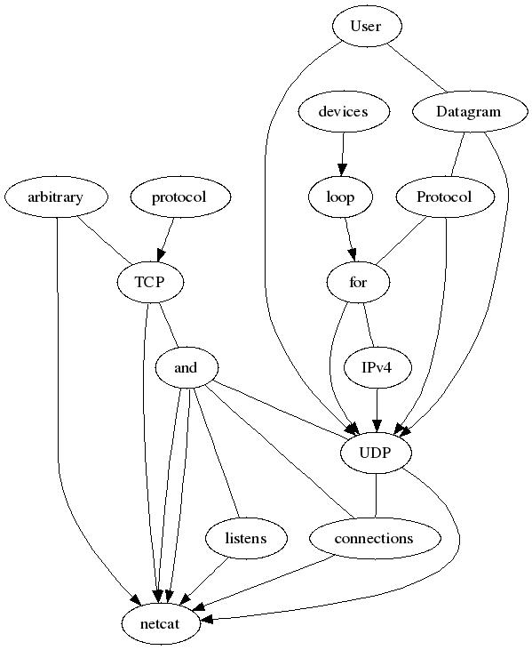

WHAT THE FUCK IS THAT!!?
====

what is what?
---
```
>whatis what
what (1ast)          - display binary identification strings
what (1p)            - identify SCCS files (DEVELOPMENT)
```
ok, I see, so what is display? binary? strings? ...

By running `./what_the_fuck_is what` ~~you can get all your answer~~, with a fully expanded response like this:

```
> ./what_the_fuck_is what
what display displays an image Create and manipulate images or sequence on any X binary Insert extract fields from strings print ship data test check file Manipulate names attributes POSIX safety concepts color curses CRT screen manager with terminal emulation handling optimization package Facilities for loop devices loading version OpenSSL command bashbuiltins bash GNU SHell see execute a simple basic traffic control filter cups open Open pipeline channel possibly create relative to directory descriptor source Evaluate resource as the portable Tcl Tool Command Language script make utility maintain groups user is argument if Execute scripts conditionally it class of objects object in programs regenerate typescript session printing system shell issue prelogin message text XML node JavaScript runtime hypertext editing widgets identification conversion interface miscellaneous routines example action line read Read standard input one tool information manipulation attribute single menus determine type write send socket Linux TCP protocol network connection endpoint communication different application another description types compare mathematically visually annotate difference between its values evaluate expression given forms printer printable characters find search classes files hierarchy identify describes format Format string operations style sprintf formatted output set variables unset Delete delete things interpreter functions options Standard supported by positional parameters get Simple agent SCCS front end program segments subsystem menu extension programming menubars sizes characteristics more perusal crt viewing basis
```

what_the_fuck_is-jsonarray
---
A beatiful version expand in json (by Python json.tool), so it get easier to read:
```json
> ./what_the_fuck_is-jsonarray display
[
    "display",
    [
        "display",
        "displays",
        "an",
        "image",
        [
            "image",
            "Create",
            "and",
            "manipulate",
            "images"
        ],
        "or",
        "image",
        "sequence",
        "on",
        "any",
        "X"
    ]
]

```

what_the_fuck_is-dot
---
Display in dot directed graph `> ./what_the_fuck_is-dot netcat`



census
---
census provide wordcounts of all commands available in your path (by compgen):
```
...
fc 0 170 1269
fg 0 28 164
getopts 0 13 92
hash 0 188 1419
popd 0 6 37
printf 0 207 1556
cameratopam 0 276 2061
...
```

